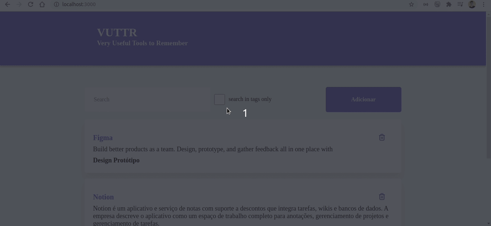

<h1 align="center">
  VUTTR WEB
  
</h1>

# Indice
- [Sobre](#-Sobre)
- [Tecnologias Utilizadas](#-tecnologias-Utilizadas)
- [Como baixar o projeto](#-como-baixar-o-projeto)
- [Rotas](#-rotas)


## 🗒 Sobre


O **Vuttr WEB** é uma aplicação front-end para um 
aplicativo que é um repositório simples para gerenciamento de ferramentas com seus respectivos nomes, links, descrições e tags.  Esse APP WEB foi desenvolvida para o desafio da **BossaBox**.
---

## 🚀 Tecnologias utilizadas

- [React](https://pt-br.reactjs.org/')
- [Styled-Components](https://styled-components.com/')
- [Type Script](https://www.typescriptlang.org/')
- [Swagger](https://swagger.io/specification/')


## 📦 Como baixar o projeto


```bash

  #Clonar o repositório
  $git clone https://github.com/limaantonio/VUTTR_front-end_TS
  
  # Entrar no repositório
  $ cd VUTTR_front-end_TS

  # Instalar as dependencias
  $ yarn ou npm install 

  # Inciar o projeto
  $ yarn start

```


Desenvolvido por Antonio Carlos
